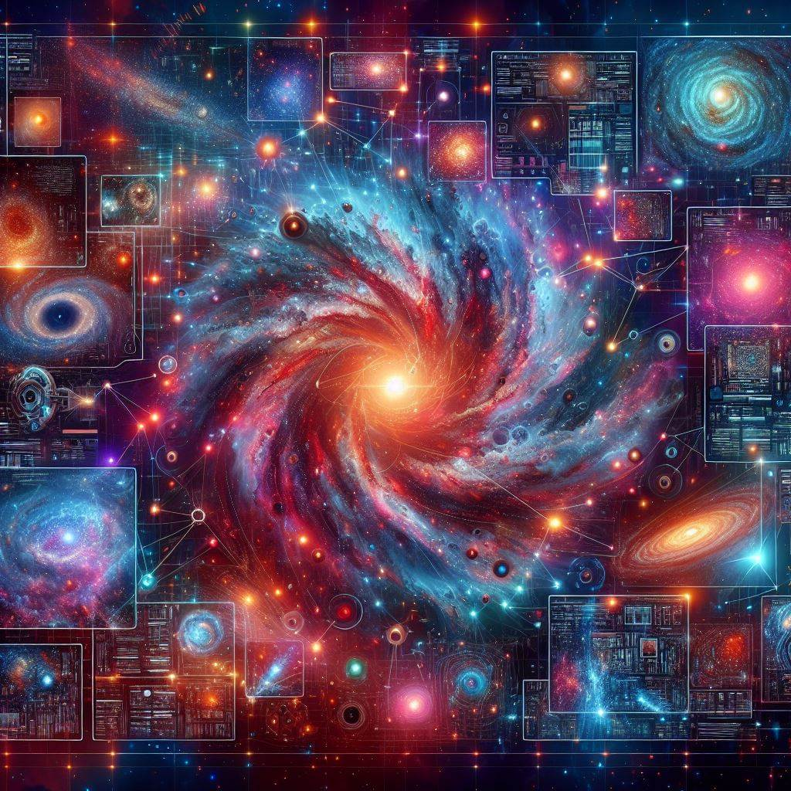
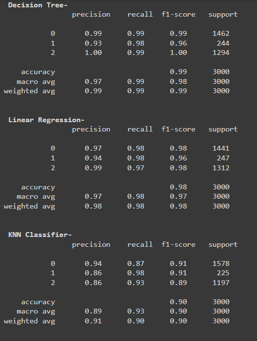
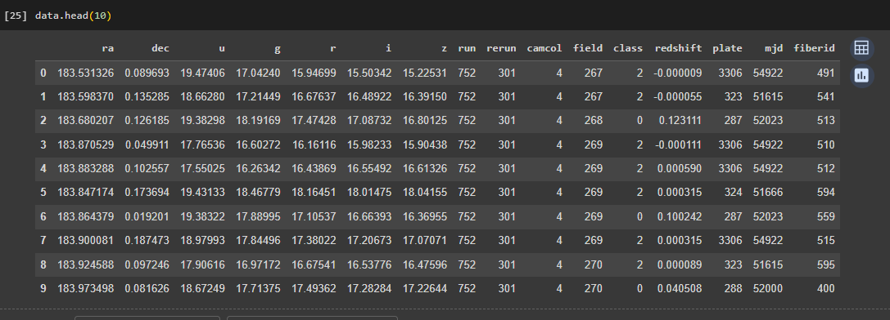
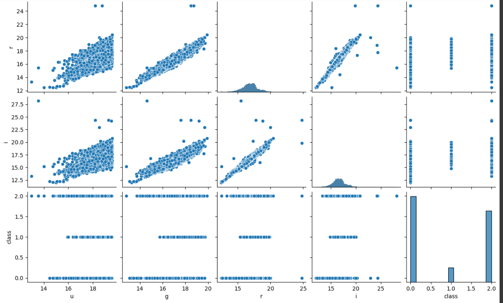

# Cosmic Classification: Machine Learning Insights into Stars, Galaxies, and Quasars

## Introduction
In this project, we explore the vastness of space through data science, aiming to classify celestial objects into three main categories: stars, galaxies, and quasars. Leveraging data from the Sloan Digital Sky Survey (SDSS), we employ machine learning techniques to predict the class of each observation.

## Dataset Overview
The dataset comprises 10,000 observations captured by the SDSS. Each observation is described by 17 feature columns and 1 class column, which identifies it as a star, galaxy, or quasar. Here's a brief overview of the key features:
- `ra` (Right Ascension) and `dec` (Declination): Coordinates on the sky analogous to longitude and latitude on Earth.
- `u`, `g`, `r`, `i`, `z`: Magnitudes measured in different wavelength bands.
- `run`, `rereun`, `camcol`, `field`: Parameters related to the observational setup.
- `specobjid`, `redshift`, `plate`, `mjd`, `fiberid`: Identification and observational details.
- `class`: Object class (galaxy, star, or quasar).

## Output Analysis
To better understand the classification performance, we assessed several machine learning models, including Decision Tree, Linear Regression, and KNN Classifier. The classification report, depicted in "classification_metric.png," provides insights into the precision, recall, and F1-score for each class.

Additionally, "dataset.png" offers a visual representation of the dataset's structure and characteristics, aiding in feature exploration and preprocessing.

Moreover, the correlation among different features is visualized in "pairplot.png," highlighting potential relationships and insights for model training and interpretation.

This README serves as a guide to understanding the project's objectives, dataset features, and model performance, paving the way for further exploration and analysis in the realm of astronomy and data science.
